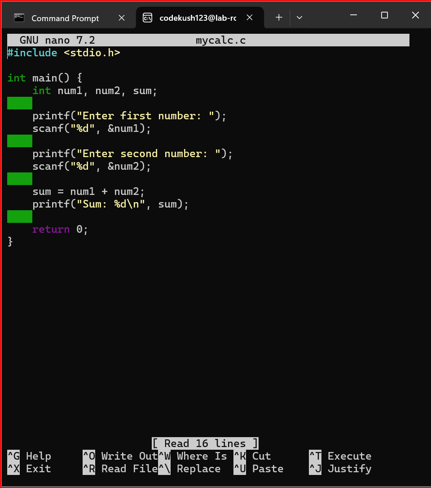
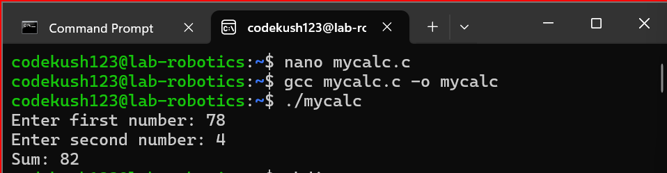
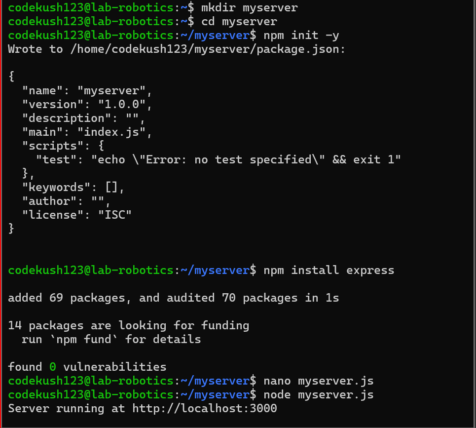
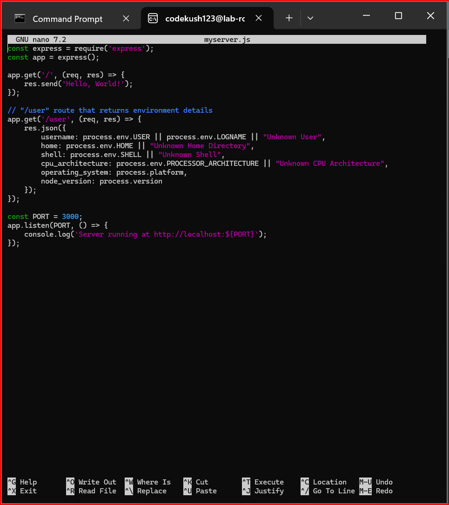
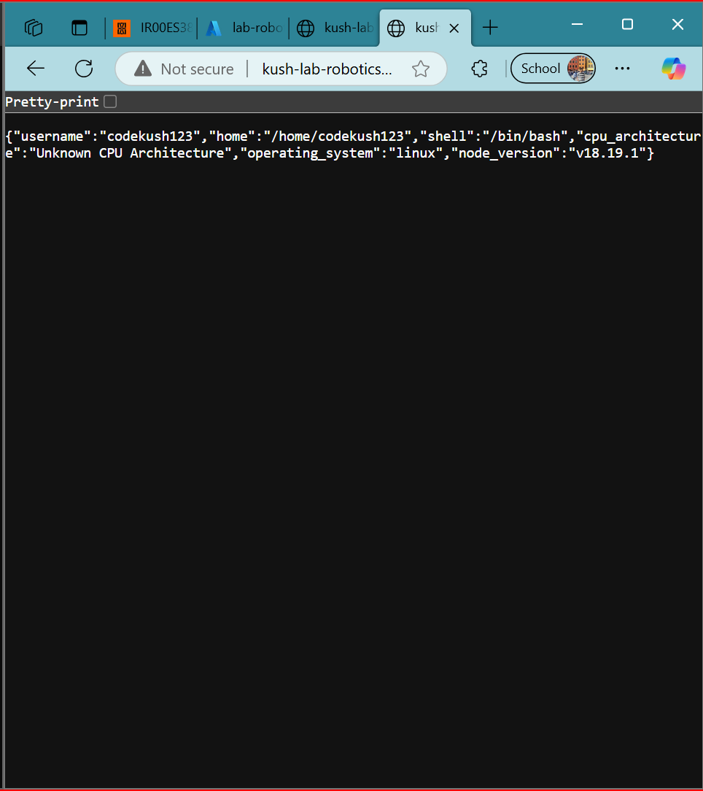
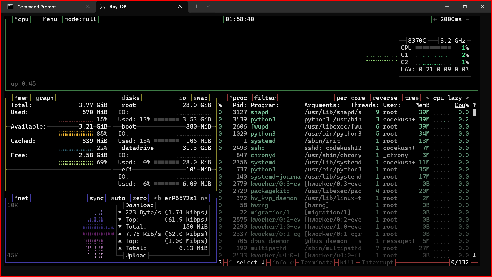

# Assignment 1

## Step 1:

- Install gcc and make a small C program

        nano mycalc.c

- Then add my C program that take two numbers from the user and give sum of those two numbers.

- Output:

## Step 2:

- Install Node.js and npm. Make a new directory "myserver", cd there and install Express web server

- Add the following code into myserver.js

- Output:

- This gives an output of user in a json form.

## Step 3:

- Install python3 and pip

- Install bpytop and it's UI looks like this

