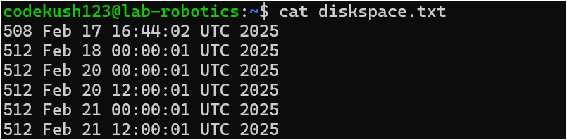
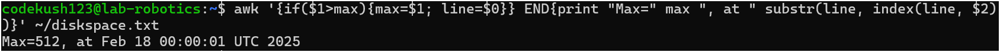

# Kush Patel

# Assignment 5 - Scripting and cron

## Step 1 Create the print.sh Script with the following code

        du -s $HOME | awk '{print $1, strftime("%b %d %T %Z %Y", systime())}' >> ~/diskspace.txt

## Step 2 Setup a cron job

        crontab -e

- Now add the following line in the script

        0 */12 * * * ~/print.sh

- and then verify the cron job

        crontab -l

## Step 3 Check execution logs

- display the output

        cat ~/diskspace.txt

- Find the maximum size record

        awk '{if($1>max){max=$1; line=$0}} END{print "Max=" max ", at " substr(line, index(line, $2))}' ~/diskspace.txt

output:

- Find the maximum.

### Thank You