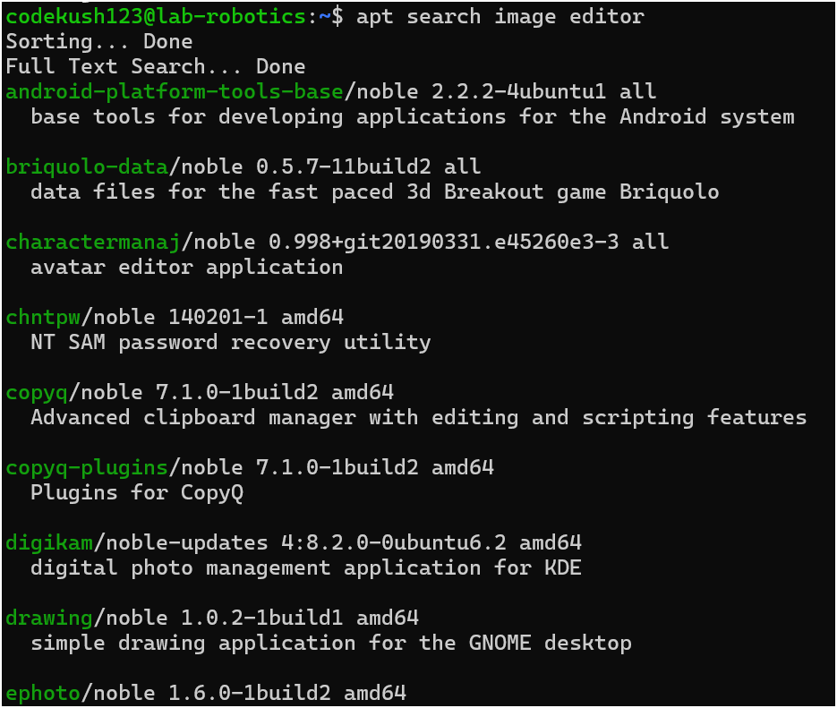
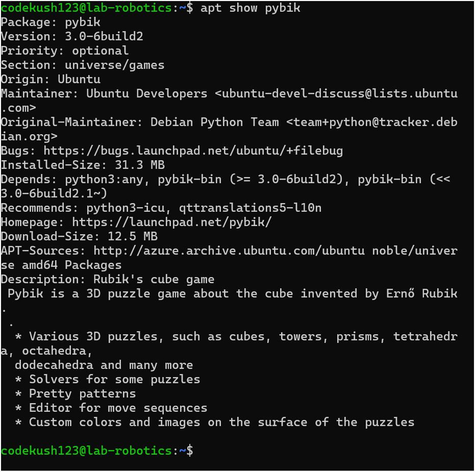
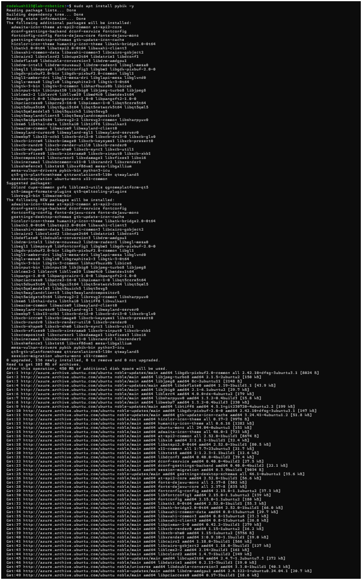
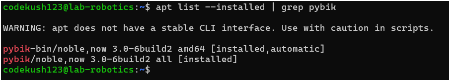
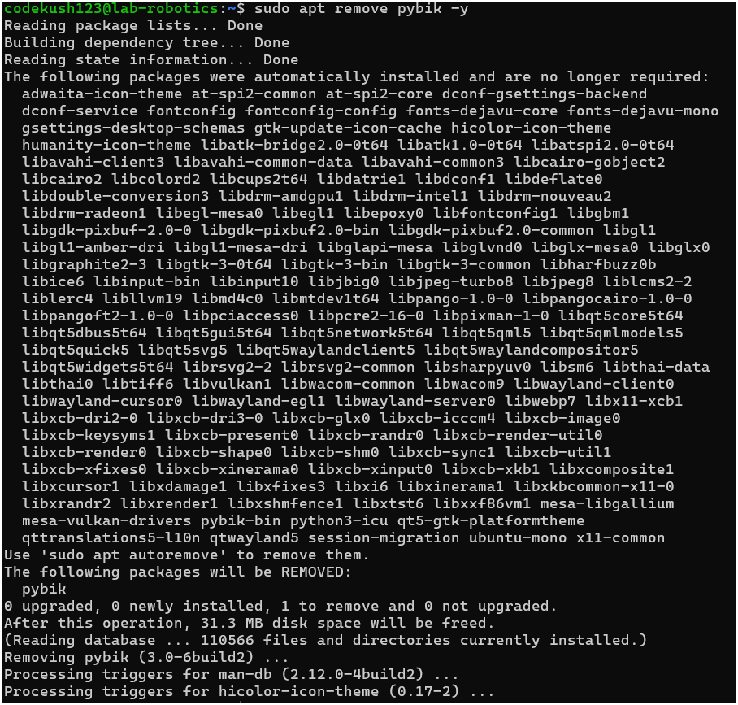
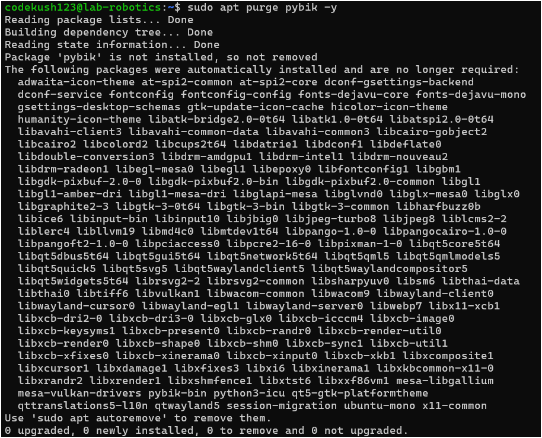
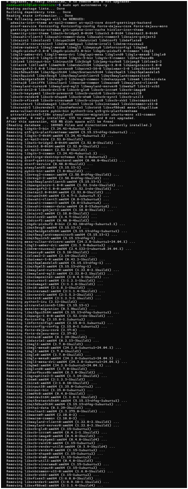
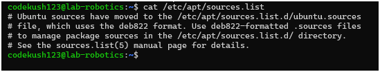
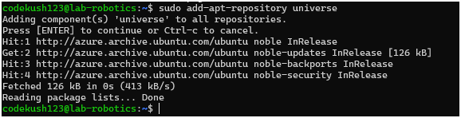
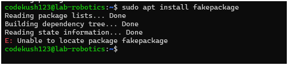

# Kush Patel

# APT Package Management Assignment

## Part 1: Understanding APT & System Updates

### 1. Check APT Version
```sh
apt --version
```
**Output:**


### 2. Update the Package List
```sh
sudo apt update
```
**Explanation:**  
This command fetches the latest package information from the configured repositories, ensuring that the system has the most up-to-date metadata before installing or upgrading packages.

### 3. Upgrade Installed Packages
```sh
sudo apt upgrade -y
```
**Difference between `update` and `upgrade`:**  
- `update` refreshes the package metadata but does not install or upgrade anything.
- `upgrade` installs newer versions of the packages based on the updated metadata.

### 4. View Pending Updates
```sh
apt list --upgradable
```
**Pending Updates:**  


## Part 2: Installing & Managing Packages

### 1. Search for a Package
```sh
apt search image editor
```
**Selected Package:**  
- Though, there are many packages but that doesn't fit in the screenshot :)


### 2. View Package Details
```sh
apt show pybik
```
**Dependencies:**  


### 3. Install the Package
```sh
sudo apt install pybik -y
```
**Confirmation of Installation:**  


### 4. Check Installed Package Version
```sh
apt list --installed | grep pybik
```
**Installed Version:**  



## Part 3: Removing & Cleaning Packages

### 1. Uninstall the Package
```sh
sudo apt remove pybik -y
```
**Is the package fully removed?**  


### 2. Remove Configuration Files
```sh
sudo apt purge pybik -y
```


**Difference between `remove` and `purge`:**  
- `remove` only deletes the package binaries, keeping configuration files.
- `purge` deletes both binaries and configuration files.

### 3. Remove Unnecessary Dependencies
```sh
sudo apt autoremove -y
```


**Why is this step important?**  
It removes unused dependencies that were installed alongside a package but are no longer needed, freeing up disk space.

### 4. Clean Up Downloaded Package Files
```sh
sudo apt clean
```

**What does this command do?**  
It deletes all downloaded `.deb` files from `/var/cache/apt/archives`, freeing up space.


## Part 4: Managing Repositories & Troubleshooting

### 1. List APT Repositories
```sh
cat /etc/apt/sources.list
```
**Observations:**  


### 2. Add a New Repository
```sh
sudo add-apt-repository universe
sudo apt update
```


**Types of Packages in Universe Repository:**  
Community-maintained software, which may not receive the same level of support as main repository packages.

### 3. Simulate an Installation Failure
```sh
sudo apt install fakepackage
```
**Error Message:**  


### 4. Troubleshooting Steps
- Check the package name spelling.
- Ensure the correct repository is enabled.
- Run `sudo apt update` and try again.
- Search for the package using `apt search`.
- Check logs in `/var/log/apt/`.

---

## Bonus Challenge: Holding & Unholding Packages

### 1. Hold a Package
```sh
sudo apt-mark hold pybik
```


### 2. Unhold a Package
```sh
sudo apt-mark unhold pybik
```


**Why would you want to hold a package?**  
This prevents the package from being upgraded.

**Why would you want to unhold a package?**
This allows the package to be upgraded again.
#### Thank You :)