# Virtualization

## Part 1: Introduction to virtualization concepts

1. Virtualization: the procedure for building a virtualized copy of a resource, such an operating system, storage device, or machine.
2. Hypervisor: software that makes it possible to create and administer virtual machines (VMs), which let several operating systems operate on one physical computer.
3. Virtual machines (VM):  It's a technology for building virtualized computing environments. A virtual machine is an emulation of a physical computer. VMs enable teams to run what appear to be multiple machines, with multiple operating systems, on a single computer.
4. Containers: Containers are a lighter-weight, more agile way of handling virtualization—since they don’t use a hypervisor.It is an isolated environments that run applications with shared system resources.
5. The main differences between VMs and tanks: containers allow developers to improve CPU and memory utilization of physical machines. However, containers go even further because they also enable microservice architectures, where application components can be deployed and scaled more granularly. This is an attractive alternative to having to scale up an entire monolithic application because a single component is struggling with load.

- Main difference: VMs run a full OS with a virtualized hardware layer, whereas containers share the host OS kernel. VMs are more resource-intensive due to their need for dedicated system resources, while containers are more lightweight. VMs provide strong isolation due to separate OS instances; containers share the host OS, offering less isolation.

## Part 2: Working with Multipass

1. multipass boot: Launch the default Ubuntu instance.
2. multipass list: List all running instance.
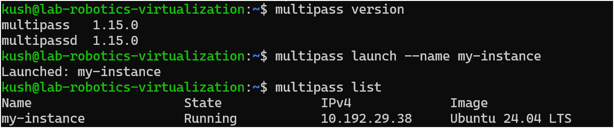
3. multipass info: View details about a specific instance.
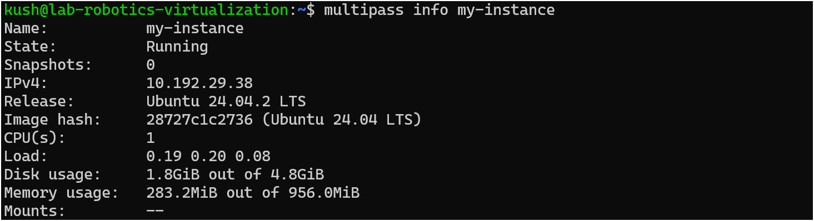
4. multipass shell: Access to the shell of a running instance.
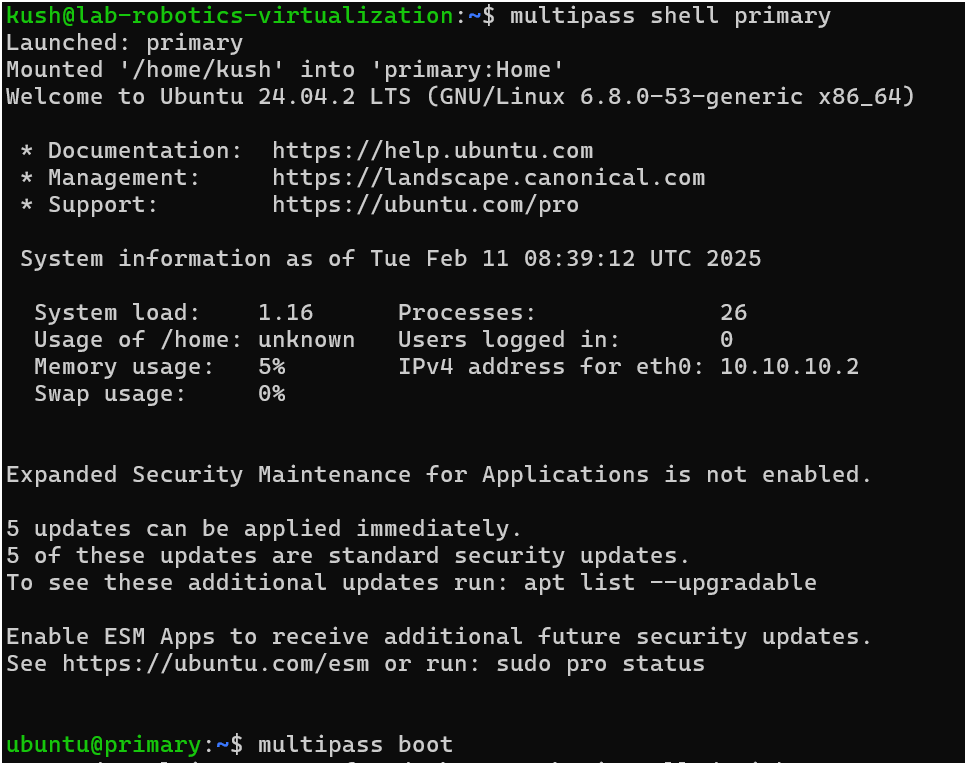
5. multipass exec: Run the command on the instance.
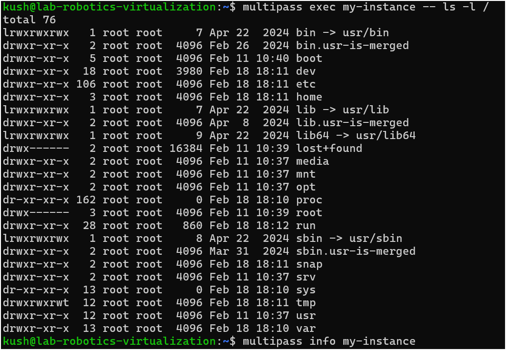
6. multipass stop: Stop the running instance.
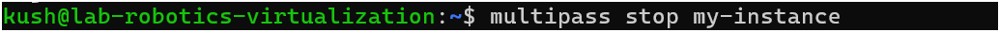
7. multipass delete: Delete the instance.
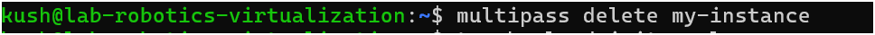

- Cloud-init: 

First of all, create a cloud-init.yaml file using command:

        touch cloud-init.yaml

then open that file and paste the following line and save it.

        #cloud-config
        package_update: true
        packages:
            - nginx

Then, launch a new instance with this configuration:

        multipass launch --name custom-instance --cloud-init cloud-init.yaml

- Share files between host and instance

        multipass mount /home/user/shared my-instance:/mnt/shared

        multipass umount my-instance:/mnt/shared

## Part 3: Exploring LXD

## Part 4: How to Stick Apps with Docker

- Installation:

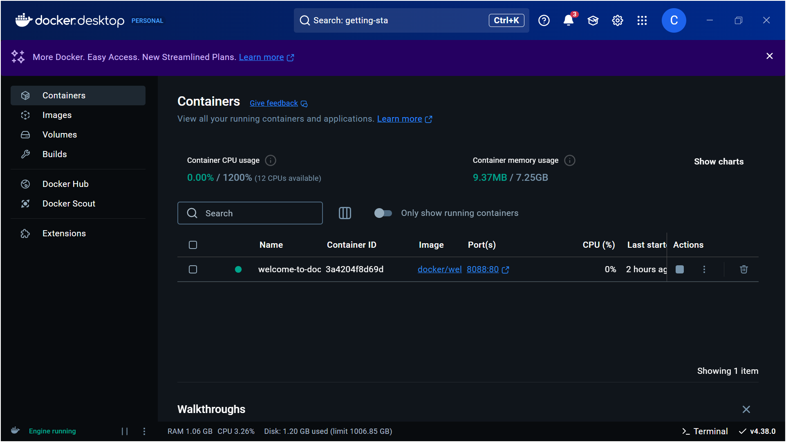

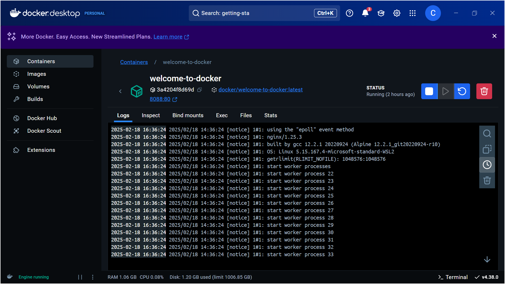

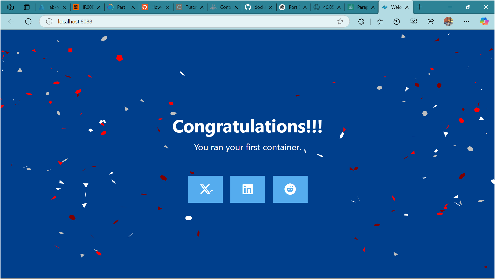

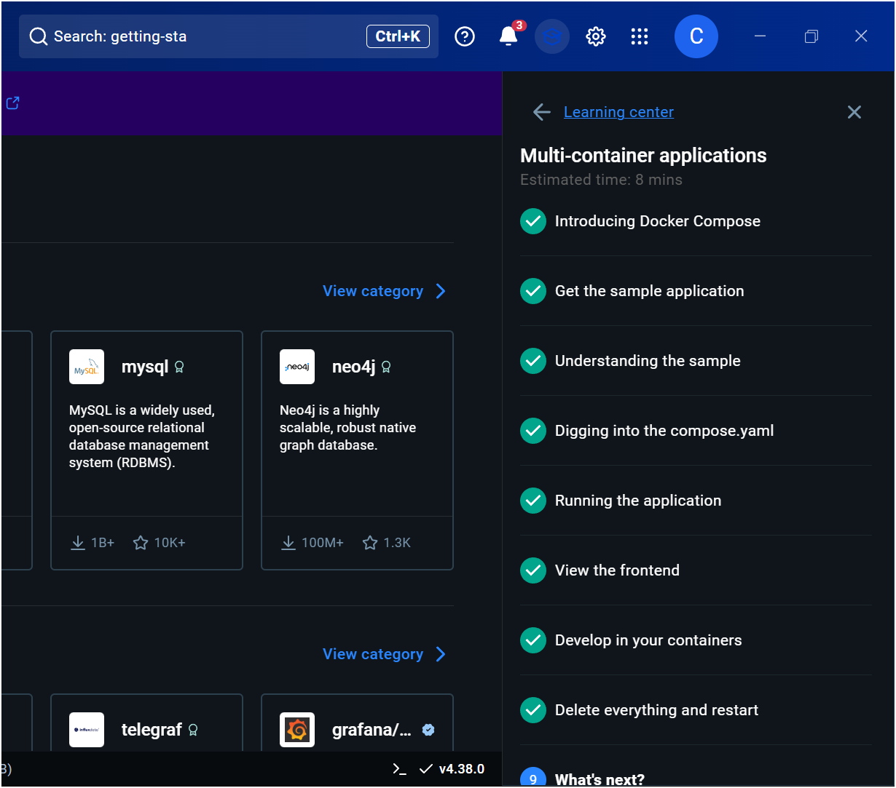

-Basic Docker Concepts

1. Images: Read-only templates used to create containers.

2. Containers: Running instances of Docker images.

3. Dockerfiles: Scripts that gives instruction on how to build a Docker image.

- Experiment

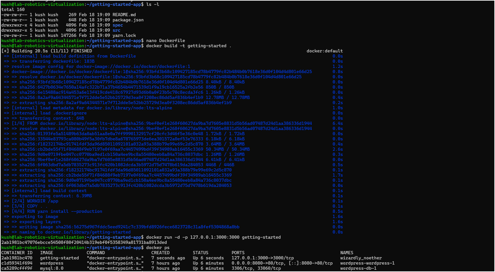