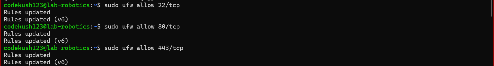
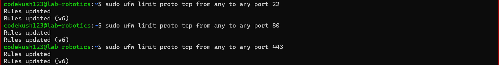
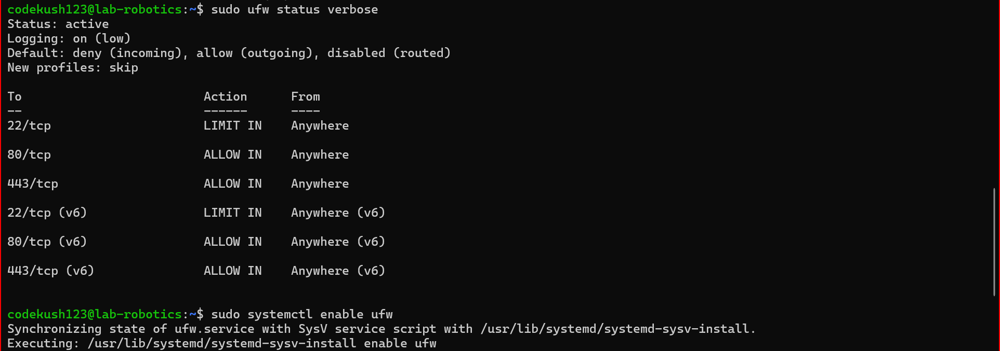

# Assignment 8 - Firewall

## Install UFW:

        sudo apt update

        sudo apt install ufw -y

## Define Firewall Rules:

- Reset UFW to deafult

        sudo ufw --force reset

- Default policies that blocks everything except allowed 

        sudo ufw default deny incoming

        sudo ufw default allow outgoing

- Allow SSH, It's port is 22

        sudo ufw allow 22/tcp

- Allow HTTP, It's port is 80

        sudo ufw allow 80/tcp

- Allow HTTPS, It's port is 443

        sudo ufw allow 443/tcp

- Prevent SYN Flood attacks

        sudo ufw limit proto tcp from any to any port 22

        sudo ufw limit proto tcp from any to any port 80

        sudo ufw limit proto tcp from any to any port 443

- Enable logging

        sudo ufw logging on

- Verify the Configuration

        sudo ufw status verbose

