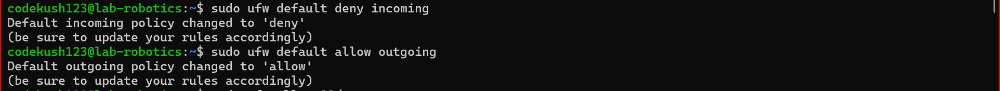
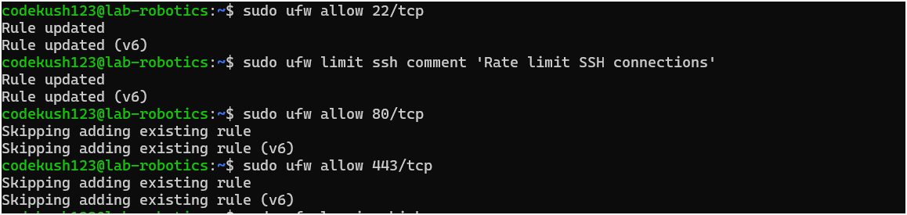

# Assignment 8 - Firewall
Kush Patel, amk1004372@student.hamk.fi

AGENDA
-
This document explains how to configure a Linux server firewall using UFW (Uncomplicated Firewall) to protect server services and prevent common network attacks. The firewall will allow necessary services such as OpenSSH, HTTP, and HTTPS while logging all blocked and allowed connections. Additionally, it will implement protections against common attacks like SYN floods and ICMP floods.

## Install UFW:

        sudo apt update

        sudo apt install ufw -y


## Define Firewall Rules:

- Reset UFW to deafult

        sudo ufw --force reset

- Default policies that blocks everything except allowed 

        sudo ufw default deny incoming

        sudo ufw default allow outgoing



- SSH (Secure Shell) is used for remote server management, but open SSH ports are common attack vectors.
- Allow SSH, It's port is 22

        sudo ufw allow 22/tcp

- Web servers need to accept incoming HTTP and HTTPS traffic for website access.
- Allow HTTP, It's port is 80

        sudo ufw allow 80/tcp

- Allow HTTPS, It's port is 443

        sudo ufw allow 443/tcp


Prevent SYN Flood attacks
-

        sudo ufw limit proto tcp from any to any port 22
        sudo ufw limit ssh comment 'Rate limit SSH connections'

        sudo ufw limit proto tcp from any to any port 80

        sudo ufw limit proto tcp from any to any port 443




Logging Configuration
-

Logging helps in monitoring traffic, debugging issues, and detecting potential attacks. 
- Enable logging

        sudo ufw logging on

        sudo ufw logging high


SYN Flood Protection
-

A SYN flood attack exploits the TCP handshake to exhaust server resources.

- Add the following to
 ```bash
        sudo nano /etc/sysctl.conf
```

- And add these items
 ```bash
        net.ipv4.tcp_syncookies = 1
        net.ipv4.tcp_max_syn_backlog = 2048
        net.ipv4.tcp_synack_retries = 2
        net.ipv4.tcp_syn_retries = 5
        net.ipv4.tcp_ecn = 0
        net.ipv4.tcp_wmem = 4096 87380 8388608
        net.ipv4.tcp_rmem = 4096 87380 8388608
```
- Finally, Apply the changes
```bash
        sudo sysctl -p
```


Block invalid packets
-

- Malicious users send malformed packets to evade detection and exploit vulnerabilities.
- In a standard TCP Three-Way Handshake, every new connection begins with a SYN packet.
- If a TCP connection starts with a different flag or an unusual combination of flags – like those generated by port-scanning tools such as Nmap – these packets should be blocked.

- Add the following to
        sudo nano /etc/ufw/before.rules

- And, add these items
        -A ufw-before-input -p tcp -m tcp ! --tcp-flags FIN,SYN,RST,ACK SYN -m conntrack --ctstate NEW -j ufw-logging-deny
        -A ufw-before-input -p tcp -m tcp ! --tcp-flags FIN,SYN,RST,ACK SYN -m conntrack --ctstate NEW -j DROP


Blocking Ping (ICMP) Requests

Why?
- An ICMP flood attack, also known as a ping flood, is a type of Denial of Service (DoS) attack. It overwhelms a system by sending a huge number of ICMP packets, specifically echo requests (pings).

How to prevent ICMP requests
-
- Open the file
        sudo nano /etc/ufw/before.rules

- Comment out the following lines
```bash

#-A ufw-before-input -p icmp --icmp-type echo-request -j ACCEPT

#-A ufw-before-forward -p icmp --icmp-type echo-request -j ACCEPT
``` 


Reload UFW to Apply change
```bash
        sudo ufw reload
```


Verify the Configuration
-
        sudo ufw status verbose

