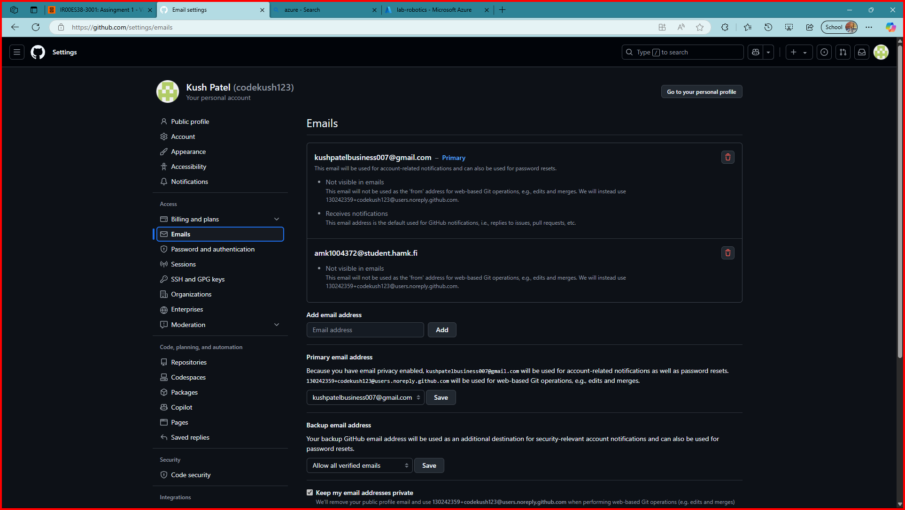
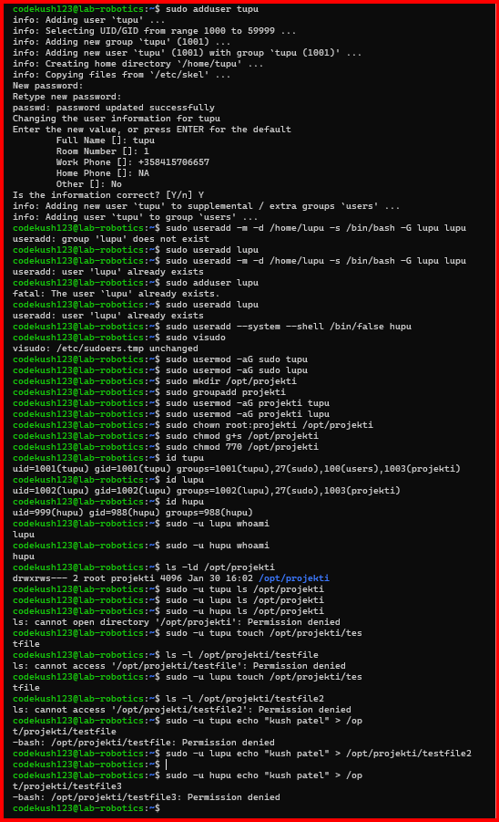
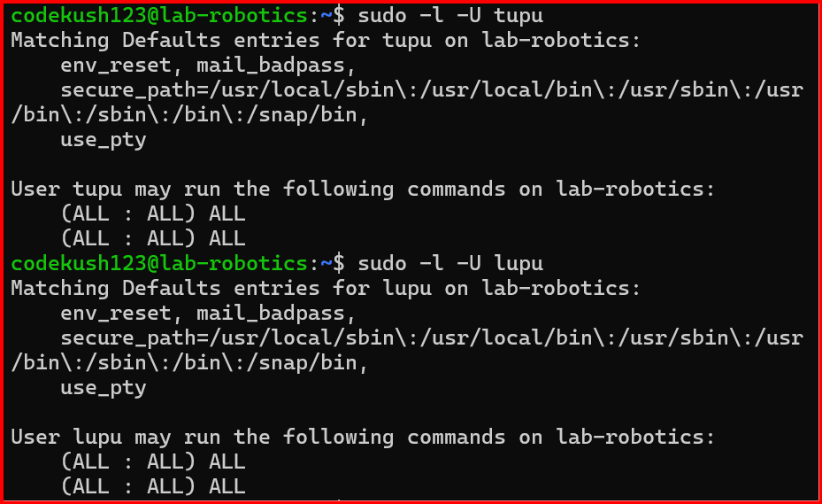

# Account Setup   //   amk1004372@student.fi
- In  the first step, I'd create an Microsoft Azure account using email address that university provoded me.

- Then I got  to know about the cloud and it's importance. 

- Additionally, I explored student benefits  and open an student account and Azure give me **$100** worth of credits that I can use to purchase any pachage within the environment.

# Create Virtual Machine
- I created virtual machine where I have to work later on this course.

- Then I select Marketplace from **Ubuntu Server 24.04 LTS gen 2 Server** published by Canonical. 

- I named my machine **"lab-robotics"**.

- I choose B series version 2 which is **Standard_B2ls_v2**.

- Later, I create a new resource group for the machine and subnet to place the machine in.

# Link my HAMK email to my GitHub account

- I create a new repository named **"linux"** for the assignment.

- Then I add my HAMK email as a secondary mail for version control.

# Assignment 3: User Management and File System Access

## Step 1:
- First of all I create two users named **tupu** and **lupu**.
- Then set **password** and other necessry information so that only that user can access the file.
- I userd sudo and adduser command for that.

        sudo adduser tupu

## Step 2:
- Then I create lupu user using useradd command.

        sudo useradd -m -d /home/lupu -s /bin/bash -G lupu lupu

- -m: Create the user's home directory.
- -d /home/lupu: Specify the home directory path.
- -s /bin/bash: Set the login shell to /bin/bash.
- -G lupu: Add the user to the lupu group.

## Step 3: 
- Furthermore, I create the hupu system user with the login shell set to **/bin/false** file.

       sudo useradd --system --shell /bin/false hupu

- --system: Create a system account.
- --shell /bin/false: Set the login shell to /bin/false to prevent login.

## Step 4: 
- Then I use **visudo** to edit the sudoers file

        sudo visudo

- Then add the following lines for both users:

        tupu ALL=(ALL:ALL) ALL
        lupu ALL=(ALL:ALL) ALL

- There is another method as well but I present here only the only but i run both.

## Step 5:
- I create directory in **/opt/projekti** and add both users

        sudo mkdir /opt/projekti

- Then crete a group called projekti and assign both tupu and lupu into the group and the commands are:

        sudo groupadd projekti
        sudo usermod -aG projekti tupu
        sudo usermod -aG projekti lupu

- And give ownership to projekti group.

        sudo chown :projekti /opt/projekti

- And **set permission** so that tupu and lupu can access the file in all three formate like read, write and execute files.

        sudo chmod 770 /opt/projekti

- The following command ensures that any new files created within the /opt/projekti directory inherit the group ownership of projekti, maintaining the desired permissions.

        sudo chmod g+s /opt/projekti

## Output:

        drwxrws--- 2 root projekti 4096 Jan 30 16:02 /opt/projekti

### Here is the screenshots of the practical.

#### Thank You